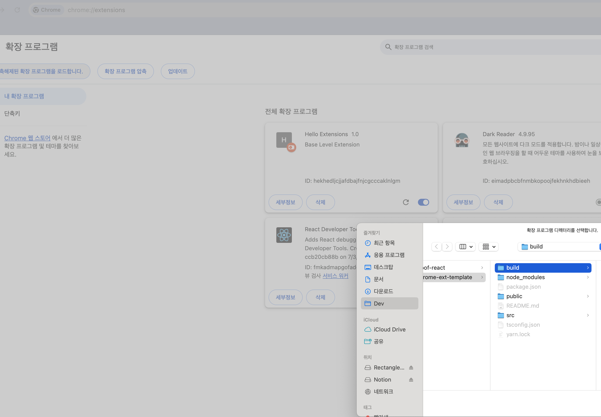

# React Chrome extension template

## Steps

1. 리액트 설치

```
yarn create react-app my-chrome-app --template typescript
```

2. `manifest.json` 수정
   `manifest.json` 은 브라우저에 이 앱에 대한 정보를 알려주는 파일입니다. 이 앱이 크롬 확장 프로그램이라는 것을 브라우저에 알려줘야 합니다.
   [여기](https://developer.chrome.com/docs/extensions/get-started/tutorial/hello-world?hl=ko)를 참고해 `manifest.json` 을 아래와 같이 작성합니다.

```
{
  "manifest_version": 3,
  "name": "Hello Extensions",
  "description": "Base Level Extension",
  "version": "1.0",
  "action": {
    "default_popup": "index.html",
    "default_icon": "logo192.png"
  }
}
```

- **manifest_version**: 이 필드는 manifest 파일의 버전을 지정합니다. 현재 Chrome에서 지원하는 최신 버전은 3입니다. 이는 확장 프로그램의 구조와 기능을 정의하는 데 중요한 요소입니다.

- **name**: 확장 프로그램의 이름을 지정합니다. 사용자가 Chrome 웹 스토어에서 이 이름으로 확장 프로그램을 찾고 인식하게 됩니다.

- **description**: 확장 프로그램에 대한 간단한 설명을 제공합니다. 사용자에게 이 확장 프로그램이 무엇을 하는지 이해할 수 있도록 돕습니다.

- **version**: 확장 프로그램의 버전을 지정합니다. 이 필드는 확장 프로그램의 업데이트 및 관리에 사용됩니다. 주로 주버전, 부버전, 패치버전 형태로 구성됩니다.

- **action**: 확장 프로그램의 사용자 인터페이스와 관련된 설정을 정의합니다. 여기에는 기본 팝업과 아이콘 설정이 포함됩니다.

- **default_popup**: 확장 프로그램 아이콘을 클릭했을 때 열리는 HTML 파일을 지정합니다. 이 경우 index.html이 기본 팝업으로 설정되어 있습니다.
- **default_icon**: 확장 프로그램의 기본 아이콘을 지정합니다. 이 경우 logo192.png라는 이미지 파일이 아이콘으로 사용됩니다.

3. 빌드

```
yarn build
```

4. 빌드 결과물 업로드
   chrome://extensions 에 들어가 빌드 결과물을 올려줍니다.
   
